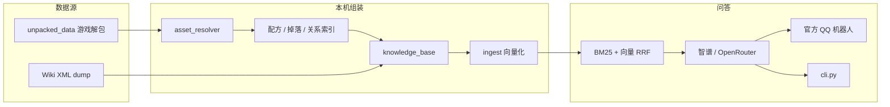

# 宇艇摘析

> **注意：纯 AI 预制菜科技小代码，一行古法手搓代码都没有，连README都是 AI 写的，有问题全是 AI 的，和我没有关系╮(╯▽╰)╭。**

Starbound（[Frackin' Universe](https://frackinuniverse.miraheze.org/) + [Arcana](https://starbound-arcana.fandom.com/)）中文 Wiki QQ 机器人。

人设是飞船电脑 **S.A.I.L**，对外叫「宇艇摘析」，自称「摘希」。玩家在群里 @ 机器人或私聊提问，它会用游戏数据包 + Wiki 检索后回答配方、掉落、群系、任务等问题，也能闲聊或从某一类里抽一条推荐。

仓库建议设为 **private**：`knowledge_base/` 是整理过的游戏数据。

## 能做什么

- **查资料**：钨矿怎么熔炼、武士刀掉落、某任务 BOSS 是谁
- **闲聊 / 角色扮演**：点菜、叫 S.A.I.L、群里玩梗
- **随机推荐**：来把枪、推荐个吃的、今天去哪
- **本地 CLI**：不接 QQ 也能在终端问答，方便调检索和人设

意图分三类：`ask`（查事实）、`chat`（闲聊）、`random`（抽签）。不确定时默认 `ask`，避免真问题被当成玩梗。

## 架构



检索是混合检索：jieba + BM25 关键词一路，智谱 `embedding-3` 向量一路，再用 Reciprocal Rank Fusion 融合，把完整文档交给 LLM。默认模型是智谱 `glm-4-flash`。

当前知识库约 **2.4 万** 条文档（物品、物体、怪物、群系、任务、Wiki 等）。ingest 会跳过质量等级 `D`。

## 仓库结构

| 路径 | 说明 |
|------|------|
| `rag/` | 问答引擎、QQ 机器人、向量入库 |
| `knowledge_base/` | 组装好的 JSON + Wiki Markdown（进 Git） |
| `wiki_articles/` | 解析后的 Wiki 正文 |
| `recipe_db/` `treasure_db/` `relationship_db/` | 配方、掉落、交叉引用中间库 |
| `deploy/` | QQ 开放平台配置、systemd、服务器更新 |
| `unpacked_data/` | 游戏解包资源（不进 Git） |
| `resolved_assets/` | patch 合并后的双语 JSON（不进 Git） |
| `rag/chroma_db/` | 向量库，约 1GB（不进 Git，本机 ingest 后单独同步） |

根目录的 `parse_wiki.py`、`asset_resolver.py`、`build_game_data.py` 等是**重建知识库**用的，日常问答不需要。

## 环境要求

- Python 3.10+
- 智谱 API Key（Embedding 必填；默认 LLM 也走智谱）
- 跑 QQ 机器人还要 [QQ 开放平台](https://q.qq.com/) 的 AppID / AppSecret
- 本机 ingest 或加载向量库时建议内存 ≥ 4GB

## 快速开始

```bash
python3 -m venv .venv
source .venv/bin/activate          # Windows: .venv\Scripts\activate
pip install -r rag/requirements.txt

cp rag/.env.example rag/.env       # 填入 ZHIPU_API_KEY；接 QQ 再填 QQ_*
```

`rag/.env` 不要提交。可配项见 `rag/.env.example`（`LLM_PROVIDER` / `LLM_MODEL`、OpenRouter、群白名单、并发等）。

### 准备向量库

仓库不含 `rag/chroma_db/`。二选一：

```bash
# 本机已有知识库时，增量入库（推荐）
cd rag
python ingest.py

# 或从已 ingest 过的机器 rsync 过来
# rsync -av --delete rag/chroma_db/ user@host:/path/fu_wiki_robot/rag/chroma_db/
```

全量重建用 `python ingest.py --reset`。**不要在生产服务器上加 `--reset`**，除非那台机器就是要重建索引。可用 `--dry-run` 只看差异、`--limit 100` 做小规模试验。

### 本地问答（不启动 QQ）

```bash
cd rag
python cli.py
python cli.py 钨矿怎么熔炼
```

### QQ 机器人

开放平台手工步骤见 [deploy/README.md](deploy/README.md)：事件选 **WebSocket**，勾选 `GROUP_AT_MESSAGE_CREATE`、`C2C_MESSAGE_CREATE`。未过审只能在沙箱测。

```bash
cd rag
python qq_bot.py --echo    # 只回声，先确认通道
python qq_bot.py           # 完整 RAG
```

群聊需 @ 机器人；单聊走消息列表，支持流式 Markdown。

## 数据管线（重建知识库）

日常改代码、调 prompt 不必走这条。只有解包数据或 Wiki dump 更新时才需要。

1. 把 Starbound / FU / Arcana 及汉化包解到 `unpacked_data/`（加载顺序见 `asset_resolver.py`）
2. Wiki dump（MediaWiki XML）放到仓库根目录，文件名含 `wiki` 即可；该 XML **不进 Git**（超过 100MB）

```bash
# Wiki → wiki_articles/
python3 parse_wiki.py frackinuniversewiki-20260903.xml -o wiki_articles

# 解包 + JSON Patch → resolved_assets/
python3 asset_resolver.py --data unpacked_data -o resolved_assets

# 中间索引
python3 recipe_index.py --assets resolved_assets -o recipe_db
python3 treasure_pool_resolver.py --assets resolved_assets -o treasure_db
python3 relationship_extractors.py --assets resolved_assets -o relationship_db

# 组装最终知识库
python3 build_game_data.py -o knowledge_base

# 向量化
cd rag && python ingest.py
```

`verify_wiki.py` 用来抽查 Wiki 解析覆盖率和清洗质量。`build_knowledge_base.py` 是较早的合并脚本，当前线上库由 `build_game_data.py` 产出。

## 部署

Linux + systemd 上线、IP 白名单、索引同步：

- 首次： [deploy/README.md](deploy/README.md)
- 日常更新（只更代码 / 同步向量库）：[deploy/SERVER_UPDATE.md](deploy/SERVER_UPDATE.md)

索引和 `.env` 不进 Git。代码用 `git pull`，`chroma_db` / `bm25_cache.pkl` 用 rsync 或分卷包。

## 评测与检查

```bash
cd rag
python intent_test.py          # 意图分类
python retrieval_test.py       # 检索
python random_draw_test.py     # 随机池
python kb_audit.py             # 知识库抽查
```

## 依赖

见 `rag/requirements.txt`：ChromaDB、httpx、jieba、rank-bm25、qq-botpy、python-dotenv。LLM 和 Embedding 走 HTTP API，无需本地 GPU。
