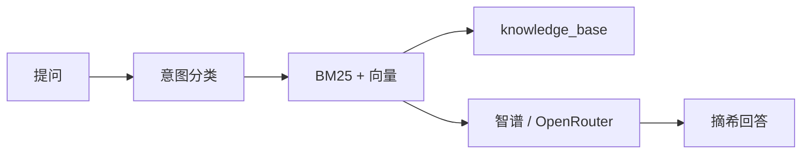

# 宇艇摘析

> **注意：纯 AI 预制菜科技小代码，一行古法手搓代码都没有，连README都是 AI 写的，有问题全是 AI 的，和我没有关系╮(╯▽╰)╭。**

Starbound（[Frackin' Universe](https://frackinuniverse.miraheze.org/) + [Arcana](https://starbound-arcana.fandom.com/)）中文 Wiki 机器人。人设是飞船电脑 **S.A.I.L**，对外叫「宇艇摘析」，自称「摘希」。

QQ 群里 @ 它，或在消息列表私聊，它按游戏数据和 Wiki 回答；也可以只在终端里问，不接 QQ。

- 查资料：钨矿怎么熔炼、武士刀掉落、某任务 BOSS 是谁
- 闲聊、角色扮演：点菜、叫 S.A.I.L、群里玩梗
- 随机推荐：来把枪、推荐个吃的、今天去哪

## 快速开始

Python 3.10+，内存建议 2GB 以上。Embedding 和默认对话走[智谱](https://open.bigmodel.cn/)，需要 API Key。

```bash
python3 -m venv .venv
source .venv/bin/activate          # Windows: .venv\Scripts\activate
pip install -r rag/requirements.txt
cp rag/.env.example rag/.env
```

在 `rag/.env` 填入 `ZHIPU_API_KEY`。换模型、走 OpenRouter、填 QQ 凭证，都在 example 里。

仓库已带 `knowledge_base/`，先做成向量索引：

```bash
cd rag
python ingest.py
python cli.py                      # 或: python cli.py 钨矿怎么熔炼
```

### 接到 QQ

[开放平台](https://q.qq.com/)建好机器人后，把 AppID / AppSecret 写入 `.env`。事件选 **WebSocket**，勾选 `GROUP_AT_MESSAGE_CREATE`、`C2C_MESSAGE_CREATE`。逐步说明见 [deploy/README.md](deploy/README.md)。

```bash
python qq_bot.py --echo            # 只回声，确认通道
python qq_bot.py                   # 完整问答
```

群聊需要 @；单聊走消息列表，支持流式 Markdown。挂到 Linux 上用 systemd 跑，步骤也在 `deploy/`。

## 架构



先判断意图：`ask` 查事实，`chat` 闲聊，`random` 从某一类里抽一条。拿不准就当 `ask`。

查资料是混合检索：jieba + BM25 对关键词，智谱 `embedding-3` 对语义，Reciprocal Rank Fusion 合成后再把完整文档交给 LLM。默认模型 `glm-4-flash`。知识库大约 2.4 万条，覆盖物品、物体、怪物、群系、任务和 Wiki。

库本身从游戏解包和 Wiki dump 组装：`unpacked_data` → `asset_resolver` → 配方 / 掉落 / 关系索引 → `build_game_data.py` → `knowledge_base` → `ingest.py`。日常问答只用 `rag/` 和建好的索引，不用重跑这条管线。
